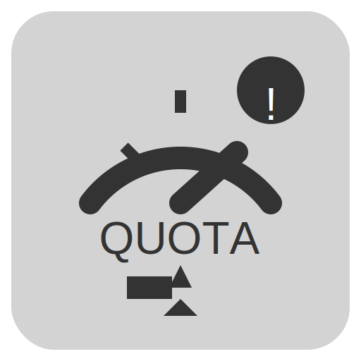

# Transfer Quota Monitor

Transfer Quota Monitor enables Nextcloud administrators to set and enforce monthly data transfer limits for users. Whether you're managing a hosting service with tiered plans or just need to prevent bandwidth abuse, this app provides the tools to monitor and control data transfer usage.

## Features

- **Individual Transfer Limits**: Set custom monthly data transfer quotas for each user
- **Real-time Monitoring**: Track data transfers as they happen
- **Tiered Notification System**: Users receive alerts at configurable thresholds (default: 80%, 90%)
- **Automatic Monthly Reset**: Transfer quotas automatically reset monthly
- **Comprehensive Admin Dashboard**: View all users' transfer usage in one place
- **Download & Upload Tracking**: Monitors both incoming and outgoing transfers
- **Registered User Support**: Works with regular and guest accounts

## Installation

### App Store (Recommended)
1. Go to Apps > Monitoring category
2. Find "Transfer Quota Monitor"
3. Click Download and Enable

### Manual Installation
1. Download the latest release from [GitHub](https://github.com/bruce90matrix/transfer_quota_monitor/releases)
2. Extract to your Nextcloud apps folder
3. Enable from the Apps management page

## Dependencies

- **[User Usage Report](https://apps.nextcloud.com/apps/user_usage_report)** is required and must be enabled
- **[Guests](https://apps.nextcloud.com/apps/guests)** is recommended for client management (if you want to track downloads by external users)

## Configuration

1. Go to Settings > Administration > Additional settings
2. Set the warning thresholds (default: 80% first warning, 90% critical warning)
3. Set individual transfer limits for each user
4. Monitor usage through the admin dashboard

### Notification System

The app provides a comprehensive notification system:

1. **In-App Notifications**: Users receive alerts via the Nextcloud notification bell when they reach threshold limits
   

2. **User Email Notifications**: Users receive email alerts when they reach threshold limits
   

3. **Admin Email Notifications**: Administrators receive email alerts when users exceed critical thresholds (90% or higher)
   

## Guest Account Strategy

For tracking downloads by external clients:

1. Use the [Guests app](https://apps.nextcloud.com/apps/guests) to create accounts for external users
2. Set appropriate transfer quotas for guest accounts
3. Share files with these accounts instead of using public links
4. All downloads will be properly tracked and counted against quotas

## Technical Details

The app works by:

- Hooking into Nextcloud's file operations system
- Tracking all file downloads by registered users
- Maintaining a database of transfer usage
- Running a monthly cron job to reset quotas

## Requirements

- Nextcloud 31 or higher
- Admin privileges for configuration
- PHP 8.0 or higher
- User Usage Report app installed and enabled
- Configured email system for notifications (SMTP)

## Credits

This app was inspired by and builds upon concepts from:

- [User Usage Report](https://github.com/nextcloud/user_usage_report) by Joas Schilling
- [Files Download Activity](https://github.com/nextcloud/files_downloadactivity) by Joas Schilling

## Support

- GitHub Issues: [Report a bug](https://github.com/bruce90matrix/transfer_quota_monitor/issues)
- Email: bruce90matrix@gmail.com

## License

AGPL v3. See [COPYING](./COPYING) for details.

